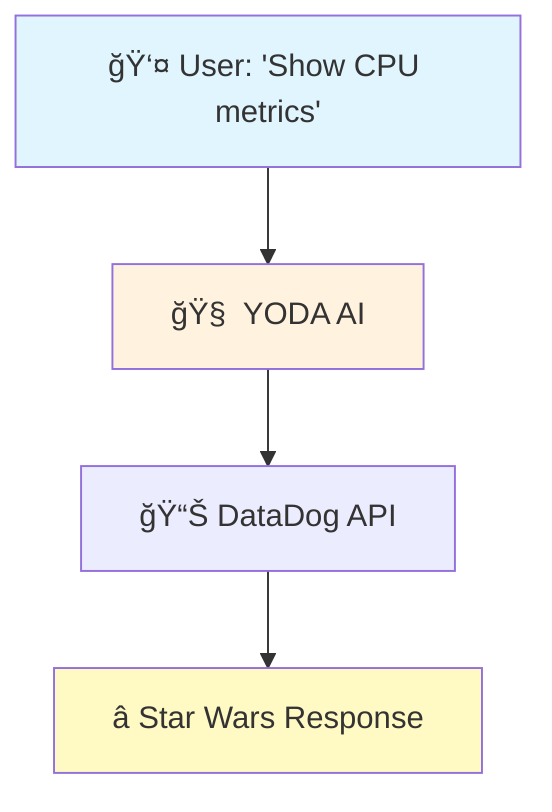
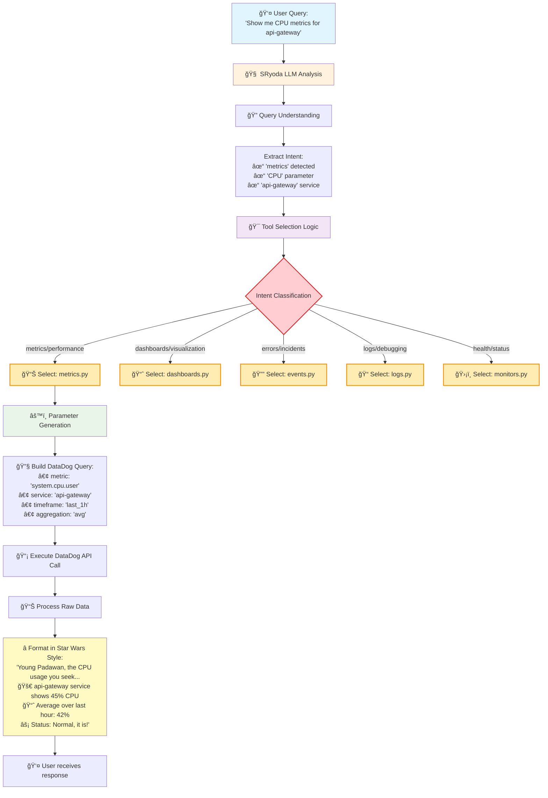

# 🌟 YODA Demo Presentation
## Strategic Reliability Engineering Operations & DataDog Analytics Droid

---

## 📋 Table of Contents

1. [Introduction](#introduction)
2. [The Problem](#the-problem)
3. [Meet YODA](#meet-yoda)
4. [System Architecture](#system-architecture)
5. [Live Demo](#live-demo)
6. [Key Features](#key-features)
7. [Technical Deep Dive](#technical-deep-dive)
8. [Value Proposition](#value-proposition)
9. [Q&A](#qa)

---

## 🯠Introduction

### What is YODA?
- **Strategic Reliability Engineering Operations & DataDog Analytics Droid**
- AI-powered monitoring interface with Star Wars personality
- Natural language to DataDog API translation
- 20+ DataDog APIs accessible through conversation

### Why YODA?
> *"Monitor your infrastructure, you must. Complex queries, unnecessary they are."* - YODA

---

## âš ï¸ The Problem

### Current DataDog Challenges:
- **Complex Query Syntax** → Steep learning curve
- **Multiple APIs** → Scattered interfaces  
- **Context Switching** → Productivity loss
- **Training Overhead** → Team onboarding delays

### Example: Simple CPU Query
```bash
# Traditional DataDog Query
avg:system.cpu.user{service:api-gateway}
.rollup(avg,300).fill(null)
```

```text
# YODA Query
"Show me CPU usage for api-gateway"
```

---

## 🤖 Meet YODA

### Core Capabilities
- **ğŸ—£ï¸ Natural Language Processing** - Talk normally, no syntax
- **🧠 Intelligent Tool Selection** - Auto-chooses right DataDog API
- **🔠Service Discovery** - Finds your services automatically  
- **â­ Star Wars Personality** - Makes monitoring fun
- **📊 Comprehensive Coverage** - 20+ DataDog APIs integrated

### The Magic


---

## ğŸ—ï¸ System Architecture

### High-Level Overview


---

## 🬠Live Demo

### Demo Flow (2 Minutes)

#### 1. Opening Hook (15 seconds)
> *"Meet YODA - our AI-powered monitoring droid that speaks Star Wars and monitors your infrastructure like a Jedi Master."*

**Show:** YODA interface with Star Wars theming

#### 2. Natural Language Queries (30 seconds)
**Demo Commands:**
```
ğŸ—£ï¸ "Show me CPU metrics for front-prod service"
ğŸ—£ï¸ "Get P1 alerts from last hour" 
ğŸ—£ï¸ "Find error logs in production"
```

#### 3. Smart Service Discovery (30 seconds)
```
ğŸ—£ï¸ "What services are available?"
ğŸ—£ï¸ "Show me metrics for api-gateway"
```

#### 4. Intelligent Tool Selection (30 seconds)
```
ğŸ—£ï¸ "Show memory usage for web-service" → Kubernetes metrics
ğŸ—£ï¸ "Find recent deployment events" → Events API  
ğŸ—£ï¸ "Get error rate trends" → APM metrics
```

#### 5. The "Wow" Factor (15 seconds)
```
ğŸ—£ï¸ "Show tools"
```

---

## 🌟 Key Features

### 🧠 AI-Powered Intelligence

**How YODA Decides Which Tool to Use:**



### 🔧 Technical Components

| Component | Purpose | Technology |
|-----------|---------|------------|
| **yoda_ui.py** | Chat Interface | Gradio |
| **mcp_loader.py** | LLM Integration | OpenAI/Custom API |
| **metrics.py** | Performance Data | DataDog Metrics API |
| **logs.py** | Error Analysis | DataDog Logs API |
| **events.py** | Incident Tracking | DataDog Events API |
| **dashboards.py** | Visualization | DataDog Dashboards API |
| **monitors.py** | Health Checks | DataDog Monitors API |

---

## 💡 Technical Deep Dive

### MCP (Model Context Protocol) Tools

#### 🔠Tool Selection Algorithm
1. **Query Analysis** - Extract intent and entities
2. **Context Matching** - Map to appropriate DataDog API
3. **Parameter Generation** - Build API-specific queries
4. **Response Formatting** - Star Wars themed output

#### 📊 Available DataDog APIs
- **Metrics API** - Performance monitoring
- **Logs API** - Error analysis and debugging
- **Events API** - Incident and deployment tracking
- **Dashboards API** - Visualization management
- **Monitors API** - Alert and health monitoring
- **APM API** - Application performance
- **Kubernetes API** - Container monitoring

### Setup Simplicity
```bash
# 1. Clone and install
git clone <repo> && cd mcp-04
pip install -r requirements_ui.txt

# 2. Configure DataDog
echo "DD_API_KEY=your_key" > .env
echo "DD_APP_KEY=your_app_key" >> .env

# 3. Launch
python start_ui.py
```

---

## 💰 Value Proposition

### 🯠Key Benefits

#### For SRE Teams:
- **â±ï¸ 80% Faster Queries** - Natural language vs complex syntax
- **📚 Zero Learning Curve** - No DataDog training required
- **🔄 Unified Interface** - All APIs in one place
- **😊 Improved Experience** - Star Wars personality reduces stress

#### For Organizations:
- **💵 Reduced Training Costs** - Instant team productivity
- **🚀 Faster Incident Response** - Quick data access
- **📈 Better Adoption** - Fun interface increases usage
- **🔧 Operational Excellence** - Comprehensive monitoring

### 📊 ROI Comparison

| Traditional DataDog | YODA |
|-------------------|------|
| 2-week learning curve | Instant productivity |
| Context switching between APIs | Single interface |
| Complex query syntax | Natural language |
| Training overhead | Zero onboarding |

---

## 🭠Demo Highlights

### Star Wars Responses Examples:

#### CPU Metrics Query:
```
User: "Show CPU for web-service"

YODA: "🯠Young Padawan, the server metrics you seek...

🚀 Service: web-service
📊 CPU Usage: 23.5%
📈 Trend: Stable in the last hour
âš¡ Status: Within normal parameters, it is!

🔠Latest readings:
• Average: 23.5%
• Peak: 28.2%
• Minimum: 19.1%

Strong with the Force, your servers are! 💫"
```

#### Error Logs Query:
```
User: "Find errors in production"

YODA: "🔠Search the logs for disturbances, I will...

âš ï¸ Recent errors found, troubled they are:

🔴 Error Count: 12 errors
📅 Time Range: Last 1 hour
🯠Most Common: 500 Internal Server Error

ğŸ› ï¸ Top Error Sources:
• api-gateway: 8 errors
• auth-service: 3 errors  
• payment-service: 1 error

Fear leads to suffering, but fix these errors you must! 🛠ï¸"
```

---

## â“ Q&A Session

### Common Questions:

**Q: How does YODA handle DataDog authentication?**
A: Environment variables store API keys securely. YODA manages all authentication automatically.

**Q: Can YODA access all DataDog features?**
A: Currently supports 20+ APIs including metrics, logs, events, dashboards, and monitors. More coming!

**Q: What if YODA misunderstands my query?**
A: The LLM includes error handling and clarification prompts. You can rephrase naturally.

**Q: Is the Star Wars theme customizable?**
A: Yes! The personality layer is configurable while maintaining the core functionality.

**Q: How does YODA scale for large teams?**
A: Built on standard web technologies with multi-user support and role-based access.

---

## 🯠Closing Statement

### The Future of Infrastructure Monitoring

> *"Your DataDog monitoring, transformed it is. Complex queries, unnecessary they become. Fun and powerful, monitoring now is!"*

### Next Steps:
1. **Try YODA** with your DataDog instance
2. **Customize** the personality for your team
3. **Expand** with additional DataDog APIs
4. **Share** the Star Wars monitoring experience

### Contact:
- **Demo Repository**: [GitHub Link]
- **Documentation**: [Setup Guide]
- **Support**: [Contact Info]

---

*May the Force be with your infrastructure! 🌟*

---

## 📚 Appendix

### Quick Command Reference:
```bash
# Metrics
"Show CPU/memory/disk for [service]"
"Get performance metrics for [service]"

# Logs  
"Find errors in [service/environment]"
"Show recent logs for [service]"

# Events
"Get alerts from last [timeframe]"
"Show deployment events"

# Dashboards
"Display dashboard for [service]"
"Show overview dashboard"

# Monitors
"Check health of [service]"
"Show monitor status"

# Discovery
"What services are available?"
"Show tools"
```

### Technical Requirements:
- Python 3.8+
- DataDog API access
- Environment variables configured
- Network access to DataDog APIs

### Troubleshooting:
- Check API keys in `.env` file
- Verify DataDog API access
- Review console logs for errors
- Test individual API endpoints